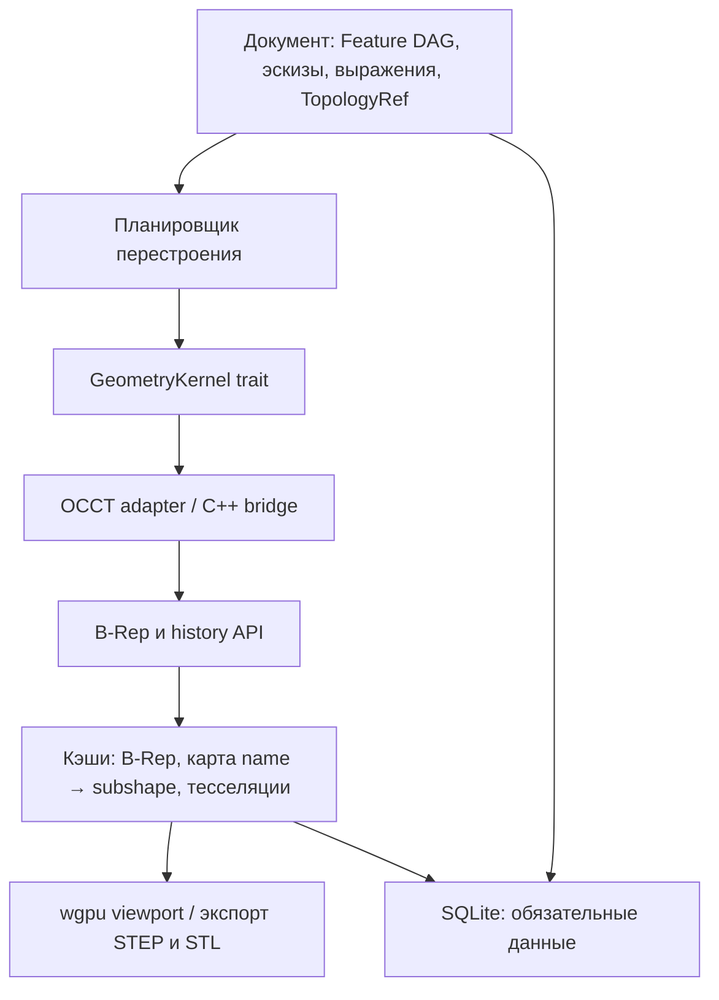

# Архитектурные решения для локального параметрического MCAD

**Статус:** принятый стартовый RFC

**Область:** нативное десктопное приложение для Windows, Linux и macOS; MVP — параметрическое 3D-моделирование одной детали.

**Название и формат:** FerriteCAD, репозиторий `ferrite-cad`, документ `.fcad`, кэш `.fcad-cache`.

**Лицензирование собственного кода:** MIT.

Все три платформы продуктовые и равноправные: падение macOS-задания в CI блокирует merge так же, как падение Windows или Linux. Практические следствия для macOS (install name `@rpath` у `libTK*.dylib`, выбор между universal binary и `lipo`, подпись и нотаризация каждой динамической библиотеки) зафиксированы в [build-occt.md](build-occt.md) и должны быть решены до первой сборки релиза, а не после.

## Цель

Создать быстрый, локальный и предсказуемый параметрический CAD, который не привязывает пользователя к облаку или закрытому формату. Первая продуктовая цель — не заменить весь SolidWorks, а дать инженеру удобный способ построить и изменить реальную деталь, сохранить её без потерь и обменяться ею через STEP и STL.

## Ключевые решения

| Область | Решение |
| --- | --- |
| Геометрическое ядро | Open CASCADE Technology (OCCT), подключённый только динамически через собственный мост C++/Rust |
| Граница FFI | Плоский `extern "C"` шим на C++17: opaque-хэндлы, `noexcept`, код возврата и структурированная ошибка |
| Язык прикладной части | Rust 2024 |
| Граница ядра | Узкий kernel-agnostic API; типы OCCT не выходят из адаптера `occt` |
| Источник истины | Типизированный граф фич, эскизы, выражения, стабильные топологические ссылки и метаданные документа |
| Кэш | B-Rep, тесселяции, превью и вычисленные сопоставления сущностей; хранится в отдельном файле-спутнике и может быть удалён в любой момент |
| Формат документа | SQLite-контейнер с CBOR payload для версионируемых объектов |
| Обмен в P0 | STEP через XDE и бинарный STL на экспорт |
| Топологическое именование | Проектируется и тестируется вместе с каждой фичей, а не как последующая доработка |
| UI и рендеринг P0 | `egui` вокруг собственного `wgpu`-вьюпорта |
| Решатель эскизов | Сравнительный прототип «свой LM/Dogleg против planegcs»; собственный Rust solver становится базовым только после прохождения реальных бенчмарков |

OCCT лицензируется под LGPL-2.1 с исключением OCCT. XDE умеет переносить через STEP имена, цвета, слои, структуру сборки и часть PMI. [Документация XDE](https://dev.opencascade.org/doc/overview/html/occt_user_guides__xde.html), [лицензия OCCT](https://github.com/Open-Cascade-SAS/OCCT).

Конкретная версия OCCT не фиксируется этим документом. Пин — это тег, который реально собрался и прошёл smoke-test на всех трёх платформах; он записывается вместе с контрольной суммой в [build-occt.md](build-occt.md) до того, как от него что-либо начнёт зависеть.

Выбор `extern "C"` вместо `cxx` объясняется устройством самого OCCT: `Handle<T>` с интрузивным счётчиком ссылок, исключения `Standard_Failure` и non-movable типы — то, с чем `cxx` работает плохо и всё равно вынуждает оборачивать каждый вызов в opaque-тип. Плоская граница проще, прямо выражает требования к ошибкам, progress и отмене, и совпадает с тем, что понадобится при выносе ядра в отдельный процесс.

Из зрелых открытых решателей эскизов доступны ровно два: planegcs из FreeCAD (LGPL-2.1, тянет Eigen под MPL-2.0 — совместимо при динамической линковке) и `slvs` из SolveSpace (GPL-3.0, запрещён лицензионной политикой ниже). Поэтому «временный внешний solver» означает planegcs или ничего, и сравнительный прототип этапа 0 не должен начинаться с поиска альтернатив.

## Граница ответственности



Ни `TopoDS_Shape`, ни индекс грани, ни указатель OCCT не попадают в обязательную модель документа. При смене ядра удаляется кэш и меняется адаптер; параметры, связи и ссылки фич остаются читаемыми.

## Модель документа

### Обязательные данные

Источник истины должен содержать:

- дерево рабочих пространств, тел и фич;
- DAG зависимостей и порядок вычисления;
- параметры фич, выражения и их единицы;
- геометрию и ограничения эскизов;
- стабильные ссылки на результаты фич и на геометрию эскизов;
- материалы, пользовательские свойства, аннотации и метаданные;
- схему, capability-флаги и минимальную версию читателя.

Внутренние единицы первой версии — миллиметры и радианы. Интерфейс может показывать другие единицы, но перед хэшированием значения нормализуются: `-0.0` превращается в `0.0`, `NaN` и бесконечности запрещены, допуски задаются явно. Выражение сохраняется как AST или исходный текст вместе с нормализованным значением, а не только как вычисленное `f64`.

### Кэш

Кэш живёт в отдельном файле-спутнике `<имя>.fcad-cache`, а не в таблицах документа. Требование «удаление кэша не меняет смысл модели» тогда обеспечивается файловой системой, а не дисциплиной: инвариант проверяется удалением файла в одну строку, документ остаётся маленьким и пригодным для git, а риск «SQLite-кэш раздувает документ» из регистра рисков исчезает по построению. Это же позволяет развести режимы журналирования — `synchronous=FULL` и rollback-журнал на документе ради переносимости одного файла, WAL на кэше ради скорости.

Спутник привязан к `document_id`, версии формата и идентификатору/версии ядра. Несовпадение по любому из полей означает, что спутник удаляется целиком и строится заново: чинить производные данные опаснее, чем пересчитать их, потому что почин может сохранить запись, которая больше не соответствует своему ключу.

В кэш входят:

- сериализованный B-Rep конкретного ядра;
- карты `stable_entity_id → kernel subshape`;
- тесселяции разных уровней детализации;
- bbox, объём, центр масс, превью и результаты HLR;
- результаты вычисления, зависящие от версии ядра, его сборки и допуска.

Ключ кэша включает как минимум вид объекта, хэш нормализованных входов, идентификатор и версию ядра, версию алгоритма фичи и параметры тесселяции. Совпадение хэша — оптимизация; несовпадение вызывает перестроение без предупреждения.

## Топологическое именование

Это основной риск системы. Ссылку нельзя задавать номером грани или порядком обхода OCCT.

Каждая ссылка фичи хранится как семантический контракт:

```text
TopologyRef {
  producer_feature: Uuid,
  output_role: SemanticRole,
  selection_intent: SelectionRule,
  expected_kind: Face | Edge | Vertex,
  fallback_signature: Option<GeomSignature>
}
```

`SemanticRole` описывает намерение, например `SketchSegment(3)`, `ExtrudeCap(Top)`, `ExtrudeSide(profile_edge)` или `FilletFace(edge_ref)`. `SelectionRule` позволяет выразить устойчивый выбор, например «все рёбра, полученные из сегмента S», вместо списка случайных граней.

Таблица устойчивых имён, происхождение и подписи сохраняются в документе. Однако привязка этого имени к конкретному `TopoDS_Shape` — вычисленный кэш. После операции адаптер собирает историю `Generated`, `Modified` и удаления; OCCT предоставляет для этого `BRepTools_History`. История полезна, но качество её данных зависит от алгоритма, поэтому у каждой фичи обязателен набор тестов на изменение предшественников. [Справочник `BRepTools_History`](https://dev.opencascade.org/doc/refman/html/class_b_rep_tools___history.html)

Разрешение ссылки идёт по порядку:

1. Точное семантическое происхождение и роль.
2. Цепочка предков и история операции.
3. Детерминированный геометрический ключ.
4. Геометрическая сигнатура только как последний, ограниченный fallback.

Если ссылка остаётся неоднозначной или не разрешается, фича не должна молча выбрать соседнюю грань. Модель останавливает это перестроение и показывает пользователю понятную потерянную ссылку.

## Формат и совместимость

Основной документ — один SQLite-файл `.fcad`. В P0 он хранит деталь; схема с самого начала допускает parts, assemblies и drawings в одном документе. `PRAGMA application_id` содержит ASCII-теги `FCAD` для документа и `FCAC` для спутника, чтобы чужая SQLite-база отвергалась до любой попытки её интерпретировать.

Таблицы документа `.fcad`:

| Таблица | Назначение |
| --- | --- |
| `meta` | версия формата, минимальная версия читателя, UUID документа, единицы отображения, даты |
| `capabilities` | возможности, обязательные для записи этого документа |
| `objects` | фичи, эскизы, тела, параметры; versioned CBOR payload |
| `deps` | ориентированные зависимости DAG с ролью каждой |
| `topology_refs` | устойчивые имена и семантические ссылки |

Таблицы спутника `.fcad-cache`:

| Таблица | Назначение |
| --- | --- |
| `cache_meta` | привязка к документу, версии формата и сборке ядра |
| `blobs` и `blob_chunks` | content-addressed кэши и крупные чанки |
| `blob_refs` | привязка кэша к объекту по ключу |

`revisions` для recovery и persistent undo появится вместе с фазой, которая её использует. Пустая таблица без пишущего кода означала бы угадывание её колонок заранее; механизм миграций для этого уже есть.

UUIDv7 хранятся как 16 байт в сетевом порядке и проверяются при чтении. CBOR payload имеет envelope `type`, `schema_version`, `required_capabilities` и `payload`, причём `payload` — вложенная CBOR byte string, а не встроенная структура. Это стоит несколько байт на объект и покупает главное свойство формата: объект неизвестного типа проходит цикл «загрузка → сохранение», ни разу не будучи декодированным, поэтому никакая деталь кодировщика не может его исказить. Неизвестный payload сохраняется байт-в-байт; документ с неподдерживаемой обязательной возможностью открывается только для чтения. Известный тип с отличающимся `schema_version` или capability-контрактом тоже сохраняется дословно, а не декодируется в форму, которой у него может не быть.

SQLite выбран за транзакционность, зрелость и возможность выборочной загрузки. Документ работает в rollback-режиме журналирования (`journal_mode=DELETE`, `synchronous=FULL`) именно затем, чтобы закрытый документ был одним самодостаточным файлом, пригодным для копирования, отправки и коммита. WAL применяется только к спутнику кэша, где три файла вместо одного ничего не стоят. [SQLite application file format](https://www.sqlite.org/appfileformat.html), [формат WAL](https://www.sqlite.org/walformat.html)

Публичный каталоговый JSON-формат и команда diff появятся после стабилизации внутренней IR. Он является зеркалом той же модели, а не вторым независимым форматом. Спецификацию формата и эталонный read-only reader следует опубликовать под MIT, когда первый формат будет стабилен, — той же лицензией, что и остальной собственный код, чтобы у проекта не появилось второй лицензии на второй артефакт.

## Геометрическое ядро и FFI

В Rust доступен только безопасный API уровня операций: построение примитива, extrude, revolve, boolean, fillet, chamfer, shell, transform, обход топологии, тесселяция и STEP/STL I/O. Граница — плоский `extern "C"` шим: каждая экспортируемая функция `noexcept` и возвращает код состояния, каждый объект OCCT пересекает границу как opaque-указатель с явной функцией-деструктором. Адаптер OCCT:

- владеет C++ объектами и преобразует все C++ исключения в структурированные ошибки;
- не пропускает исключения через FFI: разматывание стека через границу — неопределённое поведение, а не неаккуратность;
- поддерживает progress и отмену там, где её поддерживает OCCT;
- хранит параметры допусков явно;
- выдаёт history вместе с результатом операции;
- допускает асинхронный `KernelExecutor`, чтобы UI никогда не ждал расчёт.

Интерфейс проектируется так, чтобы позже выполнить его отдельным процессом. В P0 он остаётся in-process ради скорости и простоты; приоритетным кандидатом на внешний worker являются импорт непроверенного STEP и долгие операции.

## Обмен и рендеринг

- STEP: P0, чтение и запись через XDE; проверять единицы, структуру, имена, цвета и validation properties.
- STL: P0, экспорт бинарного STL из контролируемой тесселяции.
- DXF и 3MF: после готовой детали.
- DWG, JT, IFC и нативный 3D PDF: вне стартового объёма.

Вьюпорт получает готовую тесселяцию, а не вызывает тесселяцию каждый кадр. Выбор граней реализуется ID-буфером GPU. Геометрические вычисления происходят в воркерах, отменяются при новом вводе и возвращают последнее корректное изображение, пока идёт перестроение.

## Лицензионная политика

- Собственный код: MIT.
- OCCT: динамическая линковка, отображаемое уведомление, текст LGPL и сведения о получении/замене библиотеки в поставке.
- Все зависимости фиксируются в `THIRD_PARTY_LICENSES.md`; CI запускает `cargo-deny` с явным allow-list.
- GPL/AGPL-зависимости не входят в процесс приложения и не линкуются с ним.

Перед первым публичным бинарным релизом лицензионную схему необходимо проверить с юристом: этот документ задаёт инженерную стратегию, а не юридическое заключение.

## Явно отложено

До завершения MVP не входят: сборки, mates, полноценные чертежи, ЕСКД, листовой металл, плагины, Python API, облачная синхронизация, DWG/JT и собственное B-Rep-ядро.
